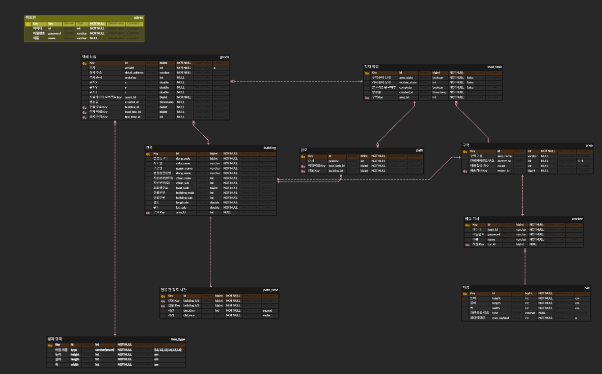

# 🚚 LOADLOGIX 

## 🌀 프로젝트 개요
### LOADLOGIX 는 배송기사를 위한 물류 적재 최적화 통합 서비스입니다 
<h3><strong>삼성 청년 SW 아카데미 자율 프로젝트</strong></h3>

<strong>📅 2024.04.08 - 2024.05.20 (6주)</strong>

## 🌀 팀원

### 📍 Backend

|

|

|

|

|
|:--:|:--:|:--:|:--:|
|팀장 신예지|정건준|백성욱|윤정인|
|PM Anylogic 로직 및 UI 구현  백엔드 공통 코드 작성, 리팩토링 백엔드 API 개발 Vue 관리자 페이지 프론트 개발|백엔드 총괄 경로 알고리즘 구현 및 최적화 백엔드 개발 및 리팩토링 적재/경로 알고리즘 연동 API CI / CD|CI / CD 적재 알고리즘 구현 및 최적화 파이썬 자바 통신 구현 백엔드 적재 API 구현|Anylogic UI 설계 백엔드 API 개발 Vue 관리자 페이지 프론트 개발 UCC|

### 📍 Frontend

|

|

|

|
|:--:|:--:|:--:|
|김보경|류진호|문경림|
|프론트엔드 리드 컴포넌트 설계 UI/UX 디자인 대시보드 페이지 구현 JIRA 일정관리 프론트엔드, 애니로직, 백엔드 API 통신 연결|프론트엔드 개발 및 리펙토링 프론트 프로젝트 골조 작성 3D 페이지 시뮬레이션 구현 API 통신 구조 및 스토어 구조 구현 랜딩 컴포넌트, 및 페이지 전체 컴포넌트 구현|와이어 프레임 구성 및 작성 할당받은 택배 적재 기능, 화물차량 규격 기능 개발 랜딩 페이지 구현|

## 🌀 프로젝트 기획 배경

현재, 물류 공장에서 일하시는 택배 기사님들은 많은 시간을 소요하여 물건을 화물차에 테트리스처럼 쌓아 올립니다.

- 택배 기사님 나름대로의 정리 방식이 있습니다.
- 정리 기준 [주소 (동, 건물), 규격, 무게] 를 고려하여 물건을 쌓아 올립니다.

따라서 LOADLOGIX는 배송 기사에게 할당 된 택배들의 우선순위를 설정하여 컨베이어 벨트에서 차례대로 내보내고, 트럭에 적재하는 3D 시뮬레이션을 보여주어 물건을 분류하고 쌓는 시간을 줄입니다.

## 🌀 프로젝트 목표

LOADLOGIX의 목표는 시뮬레이터, 알고리즘, 3D 모델링을 통한 완벽한 스마트 물류 적재 시스템을 구축하는 것이었습니다.

1. **시뮬레이터 :**  Anylogic을 사용해 물류 공장을 구축했습니다. 택배 물품을 생성하고, 저장소에 저장한 후 해당 기사 앞으로 일정 개수 이상의 택배가 쌓이면 알고리즘 처리를 시작합니다. 알고리즘 처리가 완료된 택배들은 우선순위대로 저장소에서 꺼내져 컨베이어 벨트를 통해 배송기사의 트럭 앞까지 운반됩니다.
2. **알고리즘  :** 3D Bin Packing 알고리즘으로 택배들의 주소, 규격, 무게 등을 고려해 배송기사 트럭에 적재할수 있는 최적의 시나리오를 연산합니다.
3. **3D 모델링 :** Three.dart를 사용해 알고리즘 연산이 된 택배들을 적재한 모습을 3D로 나타내어 배송 기사들에게 효율적인 가이드라인을 제시합니다.

## 🌀 주요기능

### 배송기사 페이지

- **📍 스마트 배송 관리 대시보드**
    - 배송대기 버튼을 통해 애니로직의 배송상품 적재 준비 상태를 확인할 수 있습니다.
    - 애니로직에서 적재 준비가 완료된 경우 3D 적재 시뮬레이션을 확인할 수 있습니다.
    - 배송기사 관련 정보를 확인할 수 있습니다.
    - 최근 7일 간 배송상품 개수를 그래프로 제공합니다.
    - 지도상에서 구역의 방문 순서를 볼 수 있습니다.
    - 당일 할당받은 배송상품을 방문 순서별로 조회할 수 있습니다.
    - 배송기사에게 할당된 구역의 정보가 표시됩니다.
    
- **📍 3D 적재 시뮬레이션**
    - 알고리즘을 통해 적재된 데이터를 3D로 확인할 수 있습니다.
    - 시뮬레이션 컨트롤 센터에서 구역별 통계 데이터를 조회할 수 있습니다.
    - 구역별, 상품별로 필터링해서 선택된 상품만을 3D로 조회할 수 있습니다.
    - 시뮬레이션 화면에서 레이트레이싱을 통해 상품을 선택하여 세부 정보를 확인할 수 있습니다.
    - 제어 센터에서 적재 높이, 투명도 조절을 통해  적재 상태를 볼 수 있습니다.
    - 하단의 재생바 오버레이를 통해 재생, 일시정지, 재생속도 조절, 되감기 기능을 사용해 시뮬레이션의 상태를 조절할 수 있습니다.

### 관리자 페이지

## 🌀 개발환경

### 📍 Frontend

<strong>Flutter</strong>

    

    
    
    
    
    
    
    

### 📍 Backend

<strong>Java</strong>

    

    
    
    
    
    
    

### 📍 Database

### 📍 UI / UX

### 📍 IDE

### 📍 INFRA

### 📍 형상 / 이슈관리

### 📍 기타 툴

## 🌀 ERD

## 🌀 서비스 아키텍처

