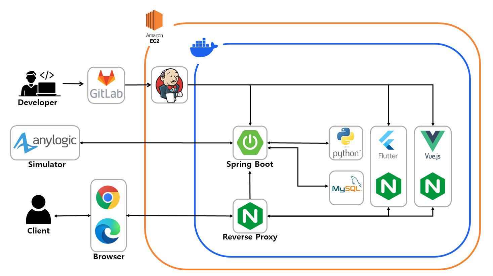

# 🚚 LOADLOGIX 

## 🌀 프로젝트 개요
### LOADLOGIX 는 배송기사를 위한 스마트 물류 적재 서비스입니다 
<h3><strong>삼성 청년 SW 아카데미 자율 프로젝트 최우수상</strong></h3>

<strong>📅 2024.04.08 - 2024.05.20 (6주)</strong>

## 🌀 ERD

## 🌀 서비스 아키텍처

## 🌀 팀원

### 📍 BACKEND

|||||
|:-:|:-:|:-:|:-:|
|팀장 신예지|정건준|백성욱|윤정인|
|PM Anylogic 통신/기능/UI 구현  백엔드 공통 코드 작성 백엔드 API 개발 Vue 관리자 페이지 프론트 개발|경로 알고리즘 구현 및 최적화 API / ERD 명세 총괄 백엔드 API 개발 및 리팩토링 CI / CD|적재 알고리즘 구현 및 최적화 CI / CD 파이썬 자바 통신 구현 백엔드 적재 API 구현 시스템 아키텍처 명세|Anylogic UI 설계 백엔드 API 개발 Vue 관리자 페이지 프론트 개발 UCC|

### 📍 FRONTEND

||||
|:-:|:-:|:-:|
|김보경|류진호|문경림|
|프론트엔드 리드 대시보드 기능 구현 프론트 API 요청 구현 컴포넌트 설계 UI/UX 디자인|3D 페이지 시뮬레이션 구현 컴포넌트 및 골조 구현 프론트 코드 리펙토링 프론트 API 통신 구조 및 스토어 구조 구현 |와이어 프레임 구성 및 작성 배송리스트 UI / 차량 규격 모달 UI 구현 랜딩 페이지 이미지 적용|

## 🌀 프로젝트 기획 배경

현재, 물류 공장에서 일하시는 택배 기사님들은 많은 시간을 소요하여 물건을 화물차에 테트리스처럼 쌓아 올립니다.

- 택배 기사님 나름대로의 정리 방식이 있습니다.
- 정리 기준 [주소 (동, 건물), 규격, 무게] 를 고려하여 물건을 쌓아 올립니다.

따라서 LOADLOGIX는 배송 기사에게 할당 된 택배들의 우선순위를 설정하여 컨베이어 벨트에서 차례대로 내보내고, 트럭에 적재하는 3D 시뮬레이션을 보여주어 물건을 분류하고 쌓는 시간을 줄입니다.

## 🌀 프로젝트 목표

LOADLOGIX의 목표는 시뮬레이터, 알고리즘, 3D 모델링을 통한 완벽한 스마트 물류 적재 시스템을 구축하는 것이었습니다.

1. **시뮬레이터 :**  Anylogic을 사용해 물류 공장을 구축했습니다. 택배 물품을 생성하고, 저장소에 저장한 후 해당 기사 앞으로 일정 개수 이상의 택배가 쌓이면 알고리즘 처리를 시작합니다. 알고리즘 처리가 완료된 택배들은 우선순위대로 저장소에서 꺼내져 컨베이어 벨트를 통해 배송기사의 트럭 앞까지 운반됩니다.
2. **알고리즘  :** 3D Bin Packing 알고리즘으로 택배들의 주소, 규격, 무게 등을 고려해 배송기사 트럭에 적재할수 있는 최적의 시나리오를 연산합니다.
3. **3D 시뮬레이션 :** Three.dart를 사용해 알고리즘 연산이 된 택배들을 적재한 모습을 3D로 나타내어 배송 기사들에게 효율적인 가이드라인을 제시합니다.

## 🌀 주요기능

### 1️⃣ 경로 알고리즘
- 택배 기사에게 할당된 택배를 기반으로 최적 베송 경로를 만드는 알고리즘입니다.
- 최적 배송 경로를 구하는 문제를 TSP라 정의하였습니다.
    - 버전 1
        - 그리디 적용
        - 현재 배송지에서 가장 가까운 배송지가 다음 배송지가 되는 방식
        - 최적 경로는 아님 
    - 버전 2
        - 완전 탐색 / DP 적용
        - DP를 사용해 최적화
        - 구역의 수 N이 높을수록 계산량이 기하급수적으로 증가
    - 버전 3
        - 휴리스틱 알고리즘 적용
        - 구역의 수 N을 높여도 한정된 시간 안에 최적과 근접한 경로를 구할 수 있음   

    

### 2️⃣ 적재 알고리즘
- 경로 알고리즘의 최적경로를 기반으로 택배를 탑차에 적재시키는 알고리즘입니다.
- 택배 바닥면 지지율 고려한 적재가 가능합니다.
- 사용자의 우선순위에 맞게 적재순서를 변경 가능합니다.
    - 우선 순위 요소
        - 도착순서
        - 상자부피
        - 상자무게 
- 택배 리스트를 받아 주소지, 부피, 무게를 고려하여 정렬합니다.
 이후, 리스트를 순회하며 상자를 하나씩 3가지 방향(Depth, Width, Height)으로 적재 가능 여부를 확인합니다.
 이때 겹치는 상자의 유무, 상품 최대 적재량, 바닥면 지지율이 60%(사용자 지정값)를 넘는지 확인하고, 가능하다면 그 위치에 상품을 적재합니다.

    

### 3️⃣ 물류 공장 시뮬레이션
- 물류 센터의 SUB 터미널을 가상으로 구축했습니다.
- HUB 터미널에서 SUB 터미널로 물품이 도착헌 이후의 시나리오 입니다.
- 물품 생성 / 저장, 적재 순서대로 물품을 컨베이어벨트에 실는 과정을 시각화합니다.

    **📍 SUB 터미널에 물품 저장**
    1. 데이터를 생성을 위해 시뮬레이터 내에서 실 배송지, 무게, 물품의 규격을 랜덤하게 생성했습니다. 생성된 물품들은 파란색 철골 구조물인 저장소에 저장됩니다.
    

    2. 저장된 물품은 경로/적재 알고리즘을 적재 순서가 결정됩니다. 이 결과를 기반으로 저장소에서 물품을 꺼내어 적재 순서대로 컨베이어벨트로 보냅니다.
    

### 4️⃣ 배송 기사 전용 사이트
- 배송 기사님이 사용하는 사이트입니다.
- 기사님이 적재 준비가 되면 적재 과정을 3D 시뮬레이션으로 보여줍니다.

    **📍 3D 적재 시뮬레이션**
    - 서비스 소개를 보여줍니다.
    

    **📍 스마트 배송 관리 대시보드**
    - 배송대기 버튼을 통해 해당 기사의 물품 적재 준비 상태를 확인할 수 있습니다.
    - 배송기사 관련 정보를 확인할 수 있습니다.
    - 최근 7일 간 할당된 배송상품 개수를 그래프로 제공합니다.
    - 경로 알고리즘을 거친 물품의 배송 순서가 지도상에 표시됩니다.
    - 배송기사에게 할당된 구역의 정보가 표시됩니다.
    

    

    **📍 3D 적재 시뮬레이션**
    - 적재 알고리즘을 통해 적재된 데이터를 3D로 확인할 수 있습니다.
    - 구역별, 상품별로 필터링해서 선택된 상품만을 3D로 조회할 수 있습니다.
    - 시뮬레이션 화면에서 레이트레이싱을 통해 상품을 선택하여 세부 정보를 확인할 수 있습니다.
    - 제어 센터에서 적재 높이, 투명도 조절을 통해  적재 상태를 볼 수 있습니다.
    - 하단의 재생바 오버레이를 통해 재생, 일시정지, 재생속도 조절, 되감기 기능을 사용해 시뮬레이션의 상태를 조절할 수 있습니다.
    

### 5️⃣ 관리자 페이지
- 물류 공장의 현황을 파악할 수 있습니다.

    **📍 관리자 대시보드**
    - 전체 물품의 개수를 확인할 수 있습니다.
    - 전체 입고/출고 물품의 개수를 확인할 수 있습니다.
    - 택배 상자 규격별 택배 개수를 확인할 수 있습니다.
    - 물류 창고의 각 저장소에 저장된 물품의 개수를 확인할 수 있습니다.
    - 구역 당 물품 할당 개수를 설정할 수 있습니다.
    - 기사 전용 사이트로 이동할 수 있습니다.
    

    **📍 실시간 입고/출고**
    - 실시간으로 입고/출고되는 물품의 정보를 확인할 수 있습니다.
    

    **📍 배송기사 리스트**
    - 배송기사들의 정보와 준비 상태를 실시간으로 확인할 수 있습니다
    

## 🌀 개발환경

<table>
    <tr>
        <th>📍 BACKEND</th>
        <td>
            
            
            
            
            
            
            
            
            
        </td>
    </tr>
    <tr>
        <th>📍 FRONTEND</th>
        <td>
                
                
                
                
                
                
                
                
        </td>
    </tr>
    <tr>
        <th>📍 INFRA</th>
        <td>    
            
            
            
            
            
        </td>
    </tr>
    <tr>
        <th>📍 OTHER TOOL</th>
        <td>
            
            
            
            
            
            
            
        </td>
    </tr>
</table>
